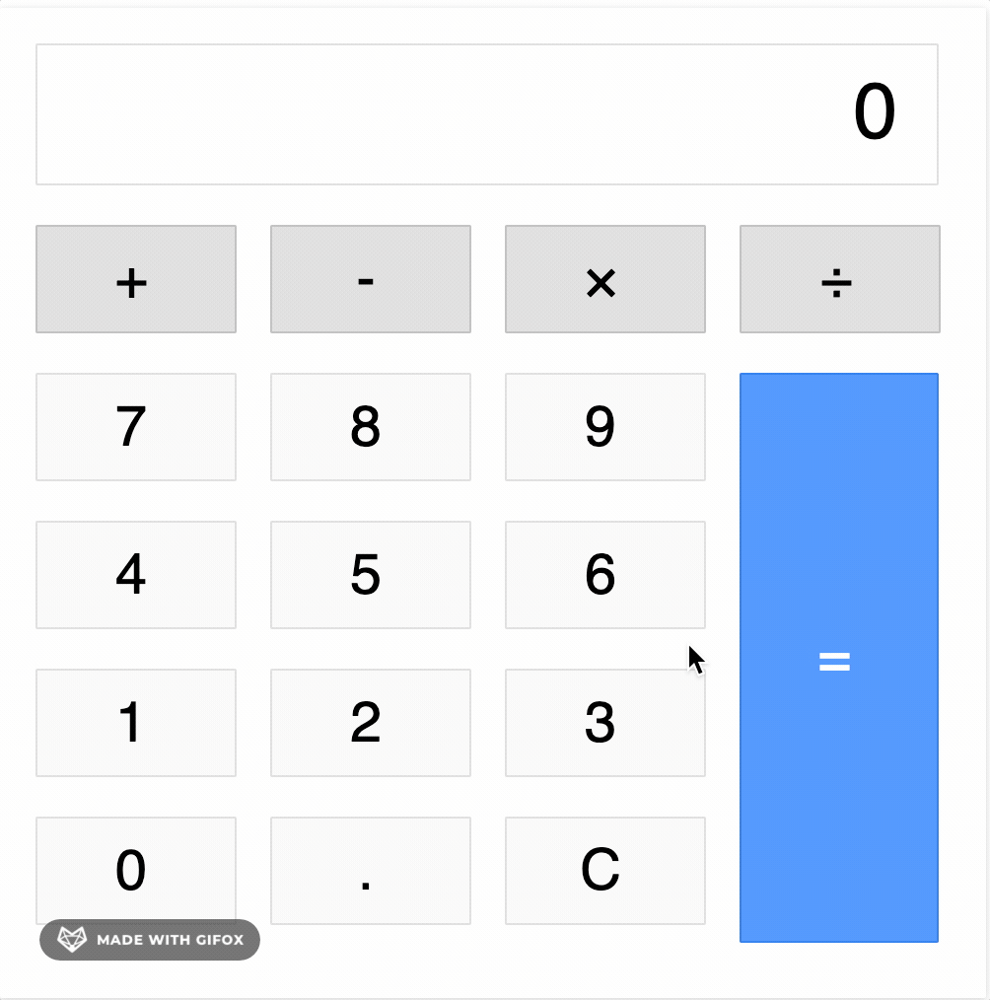

# Typescript-calculator

I implemented the calculator logic in two different ways, script1 contains the first version, script2 the second.

The first version is more thorough, version 2 uses eval and is fewer lines of code.

Live demo: https://staffanstromsholm.github.io/Typescript-calculator/

